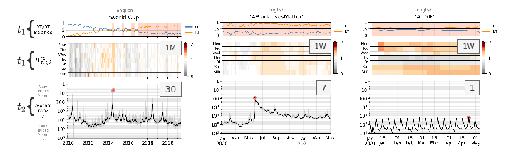

# Contagiograms 

As part of our [Storywrangler](https://gitlab.com/compstorylab/storywrangler) project, 
we present a Python package for visualizing contagiograms.

## Description 

With these expanded time series visualizations, 
we convey the degree to which an n-gram τ is retweeted 
both overall and relative to the background level of retweeting for a given language ℓ. 
We show both rates as retweet rates change strongly over time and variably so across languages.


Each contagiogram has three panels. 
The main panel at the bottom shows the rank time series for a given n-gram. 
For contagiograms running over a decade, 
we show rank time series in this main panel with month-scale smoothing (black line) of the daily values, 
and add a background shading in gray showing the daily rank. 
The smoothing scale for the main time series is a tunable parameter **t<sub>2</sub>**
that can be configured to several time resolutions 
(e.g., daily, weekly, and monthly).


The top two panels of each contagiogram capture 
the raw and relative social amplification for each n-gram. 
While still displaying values at the day scale, 
we also choose to go with month-scale moving average for these panels by default. 
They, however, 
have their own smoothing scale as a tunable parameter **t<sub>1</sub>**
that can be further configured to either monthly or weekly. 


First, the top panel displays the raw R<sub>τ,t,ℓ</sub> balance, 
the monthly relative volumes of each n-gram in retweets (RT, orange) and organic tweets (OT, blue):


When the balance of appearances in retweets outweighs those in organic tweets, R<sub>τ,t,ℓ</sub> > 0.5, 
we view the n-gram as nominally being amplified, and we add a solid background for emphasis.

Second, in the middle panel of each contagiogram, 
we display a heatmap of the values of the relative amplification rate for n-gram τ in language ℓ, 
R<sup>rel</sup><sub>τ,t,ℓ</sub>, over time. 
Building on from the R<sub>τ,t,ℓ</sub> balance, 
we define R<sup>rel</sup><sub>τ,t,ℓ</sub> as:


where the denominator gives the overall fraction of n-grams that are found in retweets on day t for language ℓ. 

When **t<sub>1</sub>** is set to monthly smoothing 
(i.e., t<sub>1</sub> = 1M),
we compute the average R<sup>rel</sup><sub>τ,t,ℓ</sub>
based on the day of the week. 
Each row displays a given day of the week starting from Monday through Sunday. 
Each cell of the first row now displays the average values of all Mondays of each month. 
If the smoothing for the top panels is set to weekly resolution 
(i.e., t<sub>1</sub> = 1W), 
each cell will display 
R<sup>rel</sup><sub>τ,t,ℓ</sub>
based on the day of the week. 
Shades of red indicate that the relative volume of n-gram τ 
is being socially amplified over the baseline of retweets in language ℓ, 
R<sup>rel</sup><sub>τ,t,ℓ</sub> > 1, 
while gray encodes the opposite, 
R<sup>rel</sup><sub>τ,t,ℓ</sub> < 1.




We show three examples with various smoothing configurations in the figure provided above. 


 
## Installation

You can install the latest verion by cloning the repo and running [setup.py](setup.py) script in your terminal

```shell 
git clone --recursive https://gitlab.com/compstorylab/contagiograms.git
cd contagiograms
python setup.py install 
```


### Install Development Version

```shell
git clone --recursive https://gitlab.com/compstorylab/contagiograms.git
cd contagiograms
python setup.py develop
```

## Usage


### Command line interface 

Navigate to the main ``contagiograms`` directory  and run [contagiograms.py](contagiograms/contagiograms.py)
```
usage: contagiograms.py [-h] [-o OUTPUT] [-i INPUT] [--flipbook] [--t1 T1] [--t2 T2] [--start_date START_DATE]

Optional arguments:
  -h, --help            show this help message and exit
  -i INPUT, --input INPUT
                        path to an input JSON file (default: None)
  -o OUTPUT, --output OUTPUT
                        path to save figure (default: ~/contagiograms)
  --start_date START_DATE
                        starting date for the query (default: 2010-01-01)
  --t1 T1               time scale to investigate relative social amplification [eg, 1W, 1M, 2M, 6M, 1Y] (default: 1M)
  --t2 T2               window size for smoothing the main timeseries [days] (default: 30)
  --day-of-the-week, --no-day-of-the-week
                        a toggle to display r_rel wrt day of the week (default: True)
  --flipbook            a flag to combine contagiograms PDFs into a single flipbook (default: False)
```

>
> Currently, we have five *layouts* for contagiograms [**rows x columns**]: (1 x 1), (1 x 2), (2 x 2), (3 x 2), (3 x 3), and (4 x 3).
>


To pass in your own ngrams you need a JSON file structured with any of the configurations noted above (see [test.json](tests/test.json))

```json
{
    "test1": [
        ["Black Lives Matter", "en"]
    ],
    "test2": [
        ["Game of Thrones", "en"], ["The Walking Dead", "en"]
    ],
    "test4": [
        ["Copa Mundial", "es"], ["Pasqua", "it"],
        ["@NASA", "en"], ["klimatet", "sv"]
    ],
    "test6": [
        ["kevät", "fi"], ["Carnaval", "pt"],
        ["Lionel Messi", "es"], ["#TGIF", "en"],
        ["virus", "fr"], ["Brexit", "de"]
    ],
    "test9": [
        ["❤", "en"], ["Resurrección", "es"], ["Coupe", "fr"],
        ["eleição", "pt"], ["ثورة", "ar"], ["@bts_twt", "ko"],
        ["Flüchtling", "de"], ["San Valentino", "it"], ["карантин", "ru"]
    ],
    "test12": [
        ["Avengers", "en"], ["Skyfall", "en"], ["Black Panther", "en"],
        ["Star Wars", "en"], ["Harry Potter", "en"], ["Jurassic World", "en"],
        ["Interstellar", "en"], ["Dark Knight", "en"], ["Inception", "en"],
        ["Frozen", "en"], ["Furious", "en"], ["Titanic", "en"]
    ]
}
```

Try it in your terminal 

```shell
python contagiograms/contagiograms.py --flipbook -i tests/test.json -o tests/
```

### Python module

```python
import contagiograms
from datetime import datetime

ngrams = {
    "test1": [
        ["Black Lives Matter", "en"]
    ],
    "test2": [
        ["Game of Thrones", "en"], ["The Walking Dead", "en"]
    ],
    "test4": [
        ["Copa Mundial", "es"], ["Pasqua", "it"],
        ["@NASA", "en"], ["klimatet", "sv"]
    ]
}

contagiograms.plot(ngrams, 'tests/')

# or using a JSON file 
contagiograms.plot(
    'tests/test.json', 
    savepath='tests/',
    start_date=datetime(2010, 1, 1),
    t1='1M',
    t2=30,
    day_of_the_week=True
)

# combine PDFs into a single flipbook
contagiograms.flipbook(savepath='.', datapath='tests/')
```

## Citation
See the following paper for more details, and please cite it if you use them in your work:

> Alshaabi, T., Adams, J.L., Arnold, M.V., Minot, J.R., Dewhurst, D.R., Reagan, A.J., Danforth, C.M. and Dodds, P.S., 2020. [Storywrangler: A massive exploratorium for sociolinguistic, cultural, socioeconomic, and political timelines using Twitter](https://arxiv.org/abs/2007.12988). *arXiv preprint arXiv:2007.12988*.

